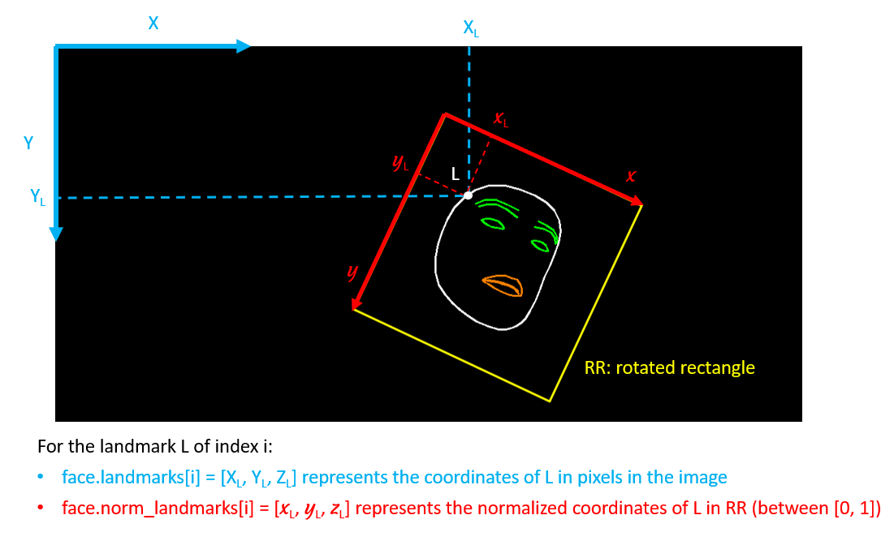
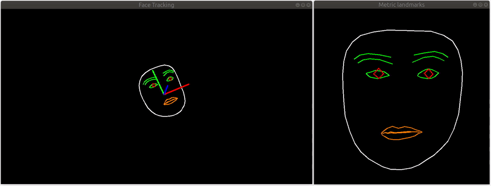
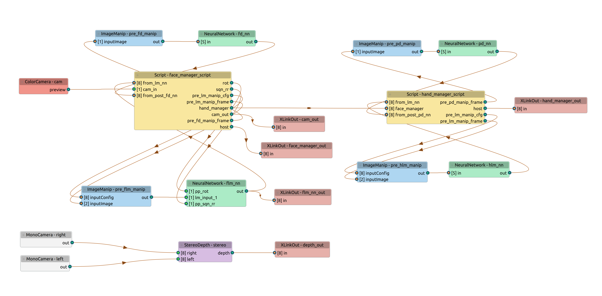

# Face and hand tracking with DepthAI

Running Google Mediapipe Face Mesh and Hand Tracking models on [Luxonis DepthAI](https://docs.luxonis.com/projects/hardware/en/latest/) hardware (OAK-D, OAK-D lite, OAK-1,...). The tracking is limited to one face and two hands. The hand tracking is optionnal and can be disabled by setting the argument `nb_hands` to 0.
<br>

<p align="center"></p>

The models used in this repository are:
- [Mediapipe Blazeface](https://drive.google.com/file/d/1d4-xJP9PVzOvMBDgIjz6NhvpnlG9_i0S/preview), the short range version, for face detection. The distance face-camera must be < 2m.
- [Mediapipe Face Mesh](https://drive.google.com/file/d/1QvwWNfFoweGVjsXF3DXzcrCnz-mx-Lha/preview) for face landmark detection(468 landmarks). I call this model the basic model in this document,
- [Mediapipe Face Mesh with attention](https://drive.google.com/file/d/1tV7EJb3XgMS7FwOErTgLU1ZocYyNmwlf/preview). This is an alternative to the previous model. In addition to the 468 landmarks, it can detect 10 more landmarks corresponding to the irises. Its predictions are more accurate around lips and eyes, at the expense of more compute (FPS on OAK-D ~10 frames/s). I call this model the attention model.
- The Mediapipe Palm Detection model (version 0.8.0) and Mediapipe Hand Landmarks models (version lite), already used in [depthai_hand_tracker](https://github.com/geaxgx/depthai_hand_tracker).

The original models are tflite models, they all have been converted to onnx with [PINTO's tflite2tensorflow](https://github.com/PINTO0309/tflite2tensorflow).
Note also that, whenever possible, the post-processing of the models output has been integrated/concatenated to the models themselves, thanks to [PINTO's simple-onnx-processing-tools](https://github.com/PINTO0309/simple-onnx-processing-tools). Thus, Non Maximum Suppression for the face detection and palm detection models  as well as some calculation with the 468 or 478 face landmarks are done at the level of the models. The alternative would have been to do these calculations on the host or in a script node on the device (slower).


## Install

Install the python packages (depthai, opencv) with the following command:

```
python3 -m pip install -r requirements.txt
```

## Run

**Usage:**

```
->./demo.py -h
usage: demo.py [-h] [-i INPUT] [-a] [-p] [-2] [-n {0,1,2}] [-xyz]
               [-f INTERNAL_FPS]
               [--internal_frame_height INTERNAL_FRAME_HEIGHT] [-t [TRACE]]
               [-o OUTPUT]

optional arguments:
  -h, --help            show this help message and exit

Tracker arguments:
  -i INPUT, --input INPUT
                        Path to video or image file to use as input (if not
                        specified, use OAK color camera)
  -a, --with_attention  Use face landmark with attention model
  -p, --use_face_pose   Calculate the face pose tranformation matrix and
                        metric landmarks
  -2, --double_face     EXPERIMENTAL. Run a 2nd occurence of the face landmark
                        Neural Network to improve fps. Hand tracking is
                        disabled.
  -n {0,1,2}, --nb_hands {0,1,2}
                        Number of hands tracked (default=2)
  -xyz, --xyz           Enable spatial location measure of hands and face
  -f INTERNAL_FPS, --internal_fps INTERNAL_FPS
                        Fps of internal color camera. Too high value lower NN
                        fps (default= depends on the model)
  --internal_frame_height INTERNAL_FRAME_HEIGHT
                        Internal color camera frame height in pixels
  -t [TRACE], --trace [TRACE]
                        Print some debug infos. The type of info depends on
                        the optional argument.

Renderer arguments:
  -o OUTPUT, --output OUTPUT
                        Path to output video file
```

**Some examples:**

- To run the basic face model with 2 hands max tracking:

    ```./demo.py``` 

- Same as above but with the attention face model:

    ```./demo.py -a``` 

- To run only the Face Mesh model (no hand tracking):

    ```./demo.py [-a] -n 0``` 

- If you want to track only one hand (instead of 2), you will get better FPS by running:

    ```./demo.py [-a] -n 1``` 

- Instead of the OAK* color camera, you can use another source (video or image) :

    ```./demo.py [-a] -i filename```

- To measure face and hand spatial location in camera coordinate system:

    ```./demo.py [-a] -xyz```

    The measures are made on the wrist keypoints and on a point of the forehead between the eyes.

- In case you need to work with the metric landmarks (see below) and/or the pose transformation matrix, which provides mapping from a static canonical face model to the runtime face, add the argument `-p` or `--use_face_pose`:
  
    ```./demo.py [-a] -p```
   


|Keypress|Function|
|-|-|
|*Esc*|Exit|
|*space*|Pause|
|1|Show/hide the rotated bounding box around the hand|
|2|Show/hide the hand landmarks|
|3|Show/hide the rotated bounding box around the face|
|4|Show/hide the face landmarks|
|5|Show/hide hand spatial location (-xyz)|
|6|Show/hide the zone used to measure the spatial location (small purple square) (-xyz)|
|g|Show recognized hand gesture (--gesture)|
|f|Switch between several face landmark rendering|
|m|Switch between several face metric landmark rendering (-p)|
|p|Switch between several face pose rendering (-p)|
|s|Apply smoothing filter on metric landmarks (-p)|
|h|Switch between several hand landmark rendering|
|b|Draw the landmarks on a black background|

## Face landmarks
Click on the image below to visualize the 468 landmarks ([*source*](https://github.com/google/mediapipe/blob/master/mediapipe/modules/face_geometry/data/canonical_face_model_uv_visualization.png)).


[<p align="center"></p>](media/canonical_face_model_uv_visualization.png)

## Hand landmarks
You can find a description [there](https://github.com/geaxgx/depthai_hand_tracker#landmarks).

## Code
The code relies on 2 classes:
* **HandFaceTracker**, responsible of computing the hand and face landmarks,
* **HandFaceRenderer**, which is an example of rendering of the landmarks. Having 2 seperate classes let you easily personalize the rendering.
  
A typical usage scenario: 
```
tracker = HandFaceTracker(...)

renderer = HandFaceRenderer(...)

while True:
    frame, faces, hands = tracker.next_frame()
    if frame is None: break
    # Draw face and hands
    frame = renderer.draw(frame, faces, hands)
    key = renderer.waitKey(delay=1)
    if key == ord('q'):
        break
```
Let's focus on:
```
frame, faces, hands = tracker.next_frame()
```
* `frame` is the raw frame on which the detections and landmark regression has been done;
* `faces` is a list of `Face` instances. Because we limit the detection to one face max, this list is either empy (if no face has been detected) or contains one element;
* `hands` is a list of `HandRegion` instances. The number of instances depends on the nb_hands parameter and the number of hands actually detected, so between 0 and 2 instances.

The classes `Face` and `HandRegion` are described in `mediapipe_utils.py`.

The schema below describes the two default types of face landmarks: `landmarks` and `norm_landmarks` (in the `Face` class):

<p align="center"></p>

By using the `-p` or `--use_face_pose` argument, a third type of landmarks becomes available: `metric_landmarks`. They correspond to the 3D runtime face metric landmarks (unit=cm) aligned with the [canonical metric face landmarks](https://google.github.io/mediapipe/solutions/face_mesh.html#canonical-face-model). In the figure below, the metric landmarks are drawn on the right side. The axis of the C.S. in which the metric landmarks are represented are drawn on the left side. Note that the origin of the C.S.  is inside the head:

<p align="center"></p>


## Pipeline

A few explanations on the pipeline:
* There are 2 Script nodes, one manages the face detection/landmark regression, the other manages the hands detection/landmark regression. However, the face manager script has more responsabilities than the hand manager script (kind-of super manager). The face manager is the only recipient of the color camera frames, the frames are then dispatched to the hand manager and to the host. This way, we assure that all the models work on the same image and the landmarks are drawn on the image used for inference. The face manager has been chosen as super manager because the face models are slower than the hand models, so it has more time to do these supplementary tasks while it waits for inference results.
* The hand landmarks are sent to the host by the hand manager script. To save time, the face landmarks are directly sent to the host by the face landmark model, and the face manager script only sends the additional information corresponding to the rotated bounding rectangle.
* The face landmark model (represented by the node named "NeuralNetwork - flm_nn" on the graph) takes 2 inputs from the face manager (pp_rot and pp_sqn_rr). They described the rotated bounding rectangle. This information is used by the model to post-process the 468 landmarks (it is faster to do the post-processing by a NeuralNet than by a Script when the amount of information to process is important).
* Stereo is aligned with the Color camera. The spatial location calcultations are done by the host, which assures that the stero frame used for the calculation is synchronized with the color frame (via timestamps).
<p align="center"></p>

## Examples

|||
|-|-|
|[Blink detection](examples/blink_detection)  |[](examples/blink_detection)|
|[Blender puppet](examples/blender)  |[](examples/blender)|

## Credits
* [Google Mediapipe](https://github.com/google/mediapipe)
* Rassibassi for the [python code](https://github.com/Rassibassi/mediapipeDemos/blob/main/custom/face_geometry.py) that calculates the face pose transformation matrix and the metric landmarks.  
* Katsuya Hyodo a.k.a [Pinto](https://github.com/PINTO0309), the Wizard of Model Conversion !
* The video used in the illustration is [6 Eye Exercises: Tighten Droopy Eyelids and Reduce Wrinkles Around Eyes/ Blushwithme-Parmita](https://www.youtube.com/watch?v=X12oV-tVIpQ&list=PLrLHadod7vE821rcmUhM0LNrrn0DR9ZUb&index=4&ab_channel=Blushwithme-Parmita)  