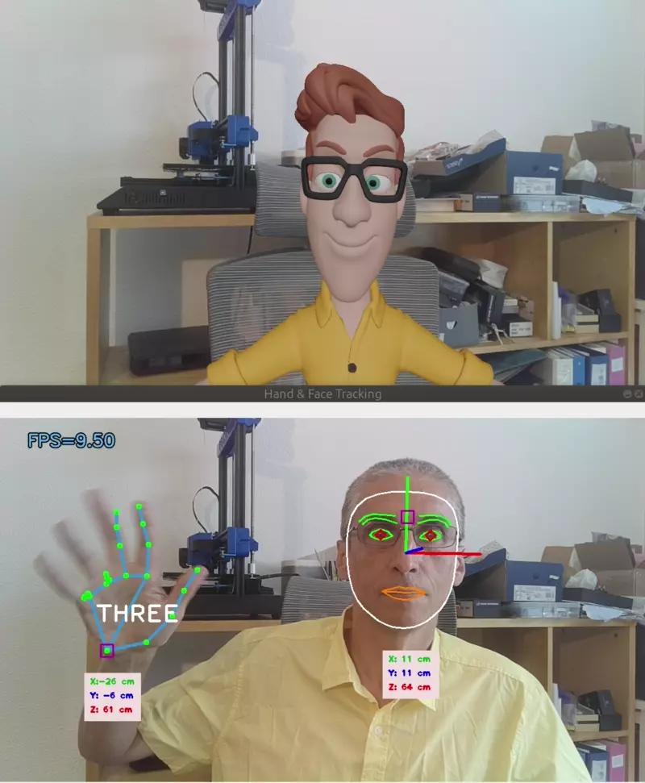
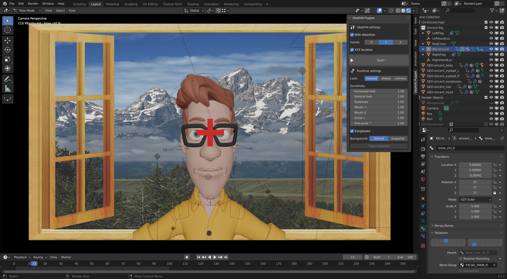
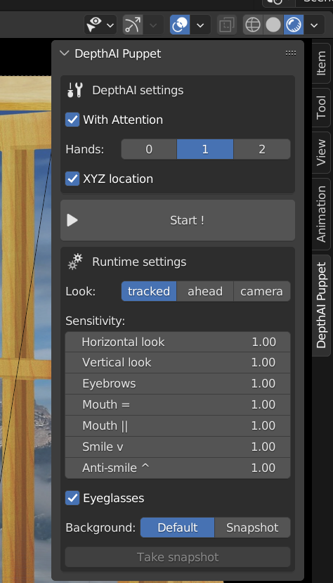

# Blender Puppet

My attempt to control in realtime a virtual character on Blender using running Mediapipe facemesh running on [Luxonis DepthAI](https://docs.luxonis.com/projects/hardware/en/latest/) hardware (OAK-D, OAK-D lite,...). 
<br>
<p align="center"></p>

- Inspired by this video: [Blender 2.8 facial mocap using OpenCV and webcam](https://www.youtube.com/watch?v=O7nNO3FLkLU)
- Using the Blender character [Vincent](https://studio.blender.org/characters/5718a967c379cf04929a4247/v1/).
- The **Facemesh with Attention** model does not run very fast on the MyriadX (~10 fps, it would run faster on a CPU with the original tflite Mediapipe model), but the depth sensing capability of the OAK-D* is useful to easily replicate the global head location relative to the camera.
- In this demo, I am not replicating the hand movements. That's something I would like to implement but I am currently not sure how to do it. Nevertheless, the real user hand is tracked and his hand orientation is used to drive the inclination of the eyebrows:
<p align="center"></p>
  
- I am new to Blender and know only a little about this powerful tool, so I am confident there is a lot of room for improvement.
  
<br>

## Install
Tested with Blender 3.2.1 on Ubuntu 18.04.<br><br>
I suppose you have already cloned this repository. Let's name `$REPO`, your local destination directory. So, the blender file you will open later in blender is: `$REPO/depthai_handface/examples/blender/demo_vincent.blend`

### 1) Install Blender
On Ubuntu, [installing Blender](https://www.blender.org/download/) consists in downloading and unzipping a zip file. Let's name `$BLENDER` the directory path where the Blender distribution is unzipped. So, typically, you should find the executable `blender` directly under `$BLENDER`.

### 2) Install the python modules
Blender comes with its own python distribution. We need to install the python modules required to run `depthai_handface`. In a command terminal, run the following commands:
```
> cd $BLENDER/3.2/python/bin
> ./python3.10 -m ensurepip
> ./python3.10 -m pip install --upgrade pip
> ./python3.10 -m pip install -r $REPO/depthai_handface/requirements.txt
```

## Run

### 1) Run blender
I recommend to start blender from a terminal (practical to read the potential error messages):

```
> cd $BLENDER
> ./blender
```

### 2) Open demo_vincent.blend
In the menu bar, `File> Open` and select `$REPO/depthai_handface/examples/blender/demo_vincent.blend`

The blender window should look like this:
<p align="center"></p>


If the following warning message appears:
<p align="center"></p>

just check `Permanently allow execution of scripts` and click `Allow Execution`.

In the panel on right side, there is a tab named `DepthAI Puppet` that centralizes the app settings:
<p align="center"></p>

**DepthAI settings** contains the parameters specific to the depthai_handface pipeline. These parameters cannot be changed when the app is running.
- `With attention`: if checked the Facemesh with attention model is used and irises are tracked. 
- `Hands`: the maximum numbers of hands tracked. If 0, there is no hand tracking. Currently, hand tracking is used to drive the eyebrows inclination. Set this parameter to 1, if you want to use this capabilty. Same behaviour if set to 2, but a bit slower so not recommended.
- `XYZ location`: if checked, the spatial location of the real user head is tracked and the puppet moves accordingly. Otherwise, the puppet head stays at a fixed location.

Click the button `Starts!` to start the app.

**Runtime settings** contains app parameters that can be changed while the app is runnig:
 - `Look`: the looking direction. If `tracked`, the looking direction follows the irises movement (only if `With attention` is checked). With `ahead`, the puppet eyes are always looking forward. With `camera`, the eyes are always looking at the blender virtual camera.
 - `Sensitivity` groups a few parameters associated with animated face parts. These parameters are float values between 0.5 and 1.5. The greater the sensitivity value, the greater the effect on the animation.
 - `Eyeglasses`: uncheck to remove the glasses.
 - `Background`: you can choose between the default background (mountain view) or a snapshot which is a picture taken with the OAKD camera by clicking the `Take snapshot` button (the app must be running for this button to be active).
  
**Setting the neutral position:**
This operation, which is a kind of calibration, is important for better results. The goal is to associate the user reference position with the rest position of the puppet. The operation is done when starting the app or on user request by pressing the "n" key. During the calibration which lasts a few seconds, a red cross appears between the puppet eyes, you should stay immobile, looking at the red cross, as neutral as possible (not smiling, sit up straight). You know the calibration is finished when the cross disappears.

To stop the app, click the `Stop` button or press the `Esc` key or right-click in the blender main window.


