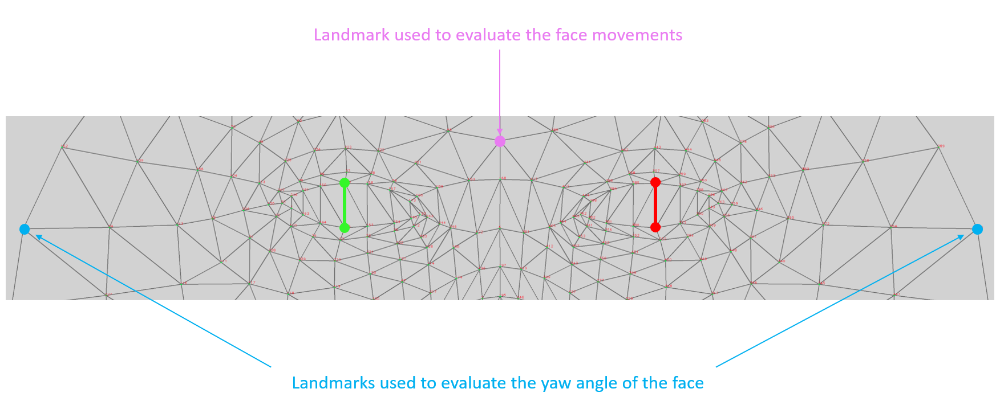

# Blink detection

Blink detection with Mediapipe Face Landmark with Attention on [Luxonis DepthAI](https://docs.luxonis.com/projects/hardware/en/latest/) hardware (OAK-D, OAK-D lite, OAK-1,...).  
<br>


<p align="center"></p>
<br>

We monitor a few landmarks on each successive frame:
  * The 2 landmarks on the upper and lower eyelids of each eye (in green and red in the schema below). The distance between the 2 landmarks gives the openness of the eye. In the top-right rolling graph above, the green (resp. red) curve represents the openness of the left (resp. right) eye. The white curve is a weighted sum of the two individual openness. When this global openness goes below a customizable threshold, we consider we have a blink. Currently, there is no control on the duration of the blink (how long the curve stays below the threshold), but it would be easy to add. Note that an eye blink usually lasts between 100 ms and 400 ms. Because the model runs at ~ 10 fps, fast blinks may be missed. **A good lighting is important for accurate detections.**
  * Depending on the yaw angle of the face, the eyes are more or less visible from the camera.
    An eye may be partially visible (e.g. the 3rd blink of the demo) or even completely invisible. In that case, we want to give more weight to the most visible eye.
    We can estimate the yaw of the face by measuring the z coordinate of the 2 "ear" landmarks, in blue in the schema below. The smaller the value, the closer to the camera. With these 2 values, we can calculate the weights used for the global openness.
  * Fast face movements can generate false positive blinks. We can monitor the face movements by measuring the position in the image of one reference landmark (in purple). The bottom-right curve above represents the distance of this landmark between consecutive frames. We decide to not count blinks if they occur when the purple curve is above a customizable threshold (white horizontal line).
   

<br>

<p align="center"></p>
<br>


## Run

**Usage:**

```
->./demo.py  -h
usage: demo.py [-h] [-i INPUT] [-e EYE_OPENING_THRESHOLD]
               [-f FACE_MOVEMENT_THRESHOLD]

optional arguments:
  -h, --help            show this help message and exit
  -i INPUT, --input INPUT
                        Path to video or image file to use as input (if not
                        specified, use OAK color camera)
  -e EYE_OPENING_THRESHOLD, --eye_opening_threshold EYE_OPENING_THRESHOLD
                        Vertical distance between upper and lower eyelids
                        below which the eye is considered blinking
  -f FACE_MOVEMENT_THRESHOLD, --face_movement_threshold FACE_MOVEMENT_THRESHOLD
                        Face movement distance between 2 consecutive frames
                        above which a potential blinking is considered invalid
```


|Keypress|Function|
|-|-|
|*Esc*|Exit|
|*space*|Pause|
|z| Reset the blink counter|
|3|Show/hide the rotated bounding box around the face|
|4|Show/hide the face landmarks|
|f|Switch between several face landmark rendering|
|b|Draw the landmarks on a black background|
